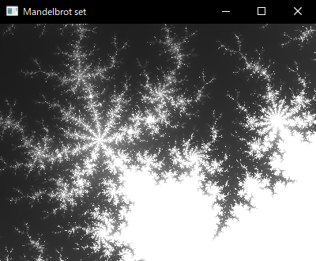

# マンデルブロ集合の描写プログラム

言語: Rust

[ソースコード](https://github.com/miura-hiroka/portfolio/tree/main/mandelbrot)

移動、ズームイン、ズームアウトができます。




# 定理証明補助プログラム

言語: Rust

ソースコード

- [Logic](https://github.com/miura-hiroka/portfolio/tree/main/logic)
- [Parser](https://github.com/miura-hiroka/portfolio/tree/main/parser)
- [Tree structure](https://github.com/miura-hiroka/portfolio/tree/main/tree)

推論規則を繰り返し適用して、命題論理の定理を形式的に証明できます。

コマンド  
`mp [ID1] [ID2]`: Modus ponens. A (`ID1`) と A -> B (`ID2`) からBを導出。  
`inst [ID] [variable] [formula]`: 自由変数を指定の式で置換。  
`show`: 証明済みの論理式をすべて表示。  
`save [filename]`: 証明済みの論理式をファイルに保存。  
`load [filename]`: 証明ファイルを読み込み。  

例: `a -> a` の証明
```
show
0: a -> b -> a
1: (a -> b -> c) -> (a -> b) -> a -> c
2: ((a -> F) -> F) -> a
inst 0 b a -> b
3: a -> (a -> b) -> a
inst 1 c a
4: (a -> b -> a) -> (a -> b) -> a -> a
inst 4 b b -> a
5: (a -> (b -> a) -> a) -> (a -> b -> a) -> a -> a
mp 3 5
6: (a -> b -> a) -> a -> a
mp 0 6
7: a -> a
```

# 再帰的な木

言語: JavaScript

[Recursive tree](https://miura-hiroka.github.io/portfolio/recursive-tree/index.html)

[ソースコード](https://github.com/miura-hiroka/portfolio/tree/main/recursive-tree)

# ライフゲーム (Conway's Game of Life)

言語: JavaScript

[ライフゲーム](https://miura-hiroka.github.io/portfolio/life-game/index.html)

[ソースコード](https://github.com/miura-hiroka/portfolio/tree/main/life-game)

